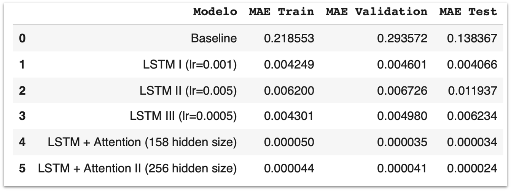
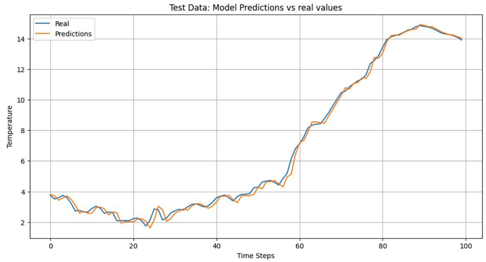

# Weather Time Series Forecasting with LSTM and Attention

This project focuses on forecasting weather time series data using Long Short-Term Memory (LSTM) networks combined with attention mechanisms. The model architecture is designed to capture temporal dependencies in weather data and highlight important features that influence the forecast.

The implementation leverages PyTorch and PyTorch Lightning for efficient model training and evaluation.

## Table of Contents
- [Technologies Used](#technologies-used)
- [Dataset](#dataset)
- [Methodology](#methodology)
- [Results](#results)

## Technologies Used
The following libraries and tools are used in this project:

- **Python Libraries:**
  - `pandas`
  - `numpy`
  - `matplotlib`
  - `seaborn`
  - `scikit-learn`
  - `torch`
  - `pytorch_lightning`

- **Additional Tools:**
  - `PyTorch Lightning` for model structuring and training.
  - `TensorBoardLogger` and `CSVLogger` for logging.

## Dataset
The dataset used in this project is the **Weather Long-Term Time Series Forecasting** dataset, which contains approximately 50,000 hourly measurements across 21 different atmospheric variables. 

- **Source:** [Kaggle - Weather Long-Term Time Series Forecasting](https://www.kaggle.com/datasets/alistairking/weather-long-term-time-series-forecasting/)

- **Description:** The dataset includes measurements such as temperature, humidity, wind speed, and precipitation, collected over 365 days with 24 hours and 6 measurements per hour. The primary goal is to predict the next temperature value (T) for a given time window.

- **Data Handling:**
  - The dataset does not come with predefined splits. The data is partitioned with **80% for training** and **20% for testing**.
  - Normalization using `MinMaxScaler` and `StandardScaler`.
  - Train-test split using `train_test_split` from `scikit-learn`.

The project employs the following steps:

1. **Data Preprocessing:**
   - Cleaning and scaling the data.
   - Optimizing the window size (w) for prediction horizons (h=1), where the model uses data from (t-w) to predict (t+1).

2. **Feature Selection**
   - Some atmospheric variables are linear combinations of others, potentially hindering model convergence. Reduced features after removing collinearity and applying feature importance selection using Random Forest.

3. **Baseline Model Development:**
   - A Multilayer Perceptron (MLP) with the following specifications:
     - One hidden layer with 100 neurons.
     - Early stopping if validation error does not decrease over 5 epochs.
     - Checkpointing to save the model with the lowest validation error.
     - Learning rate tested across {0.1, 0.01, 0.001, 0.0001}, selecting 0.0001 as the best-performing rate.
     - Optimizer: SGD with default momentum settings.
     - Batch size of 8.
     - Minimal preprocessing (normalization and randomization).
     - Window size (w) set to 4 and prediction horizon (h) set to 1.

4. **Advanced Model Development:**
   The models tested are LSTM networks combined with attention mechanisms. Several configurations were explored to optimize model performance:

   - **LSTM Models:**

     - **Model 1:**
       - Window size: 24, Horizon (h) = 1
       - Batch size: 128
       - 3 layers, 128 hidden units
       - Learning rate: 0.001
       - Early stopping with patience of 10 epochs
       - Max epochs: 100
       - Optimizer: AdamW
     - **Model 2:**
       - Same as Model 1, but with a learning rate of 0.005
     - **Model 3:**
       - Same as Model 1, but with a learning rate of 0.0005

   - **LSTM + Attention Models:**

     - **Model 4:**
       - Trainable dot product attention mechanism
       - Last pooling layer
       - Dropout probability: 0.2
       - Window size: 24, Horizon (h) = 1
       - Batch size: 128
       - 1 layer, 128 hidden units
       - Learning rate: 0.001
       - Early stopping with patience of 10 epochs
       - Max epochs: 50
       - Optimizer: AdamW
     - **Model 5:**
       - Same as Model 4, but with 256 hidden units

   - **Hyperparameter Tuning:**
     - Learning rates, hidden unit sizes, number of layers, and dropout rates were optimized for best performance.

5. **Evaluation:**
   - Comparing model performance against the baseline model.
   - Ensuring that the test set remains consistent across all models for a fair comparison.

## Results
The model's performance is compared against baseline model:
The best performing model is LSTM + Attention II (256 hidden size), achieving the lowest Mean Absolute Error (MAE) across training, validation, and test datasets.

